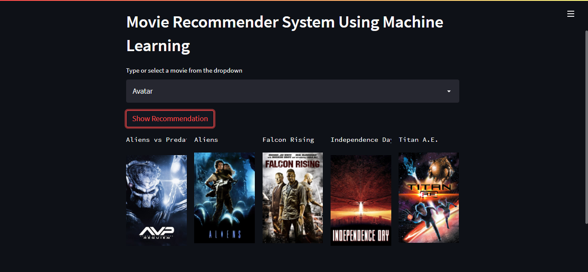

# Movie Recommender System Using Machine Learning!

# About this project:

This is a streamlit web application that can recommend various kinds of similar movies based on an user interest.


# Demo:





# How to run?
### STEPS:

Clone the repository

```bash
https://github.com/entbappy/Movie-Recommender-System-Using-Machine-Learning.git
```
### STEP 01- Create a conda environment after opening the repository

```bash
conda create -n movie python=3.7.10 -y
```

```bash
conda activate movie
```


### STEP 02- install the requirements
```bash
pip install -r requirements.txt
```


